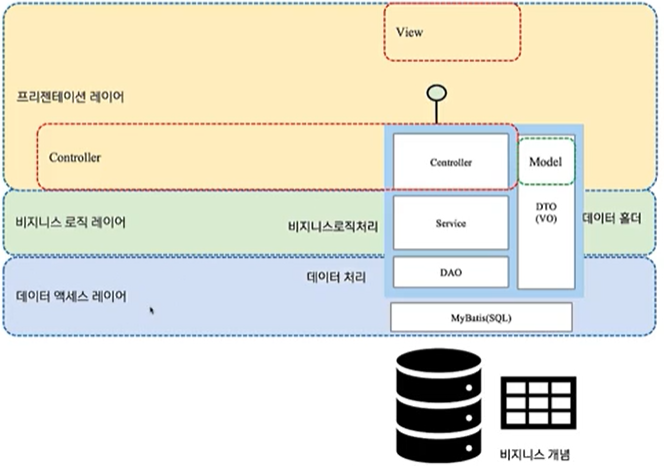

### 서블릿

**자바 플랫폼 엔터프라이즈 에디션**
- a.k.a. Java platform. Enterprise Edition, Java EE, J2EE
- 자바 언어를 사용하여 엔터프라이즈 애플리케이션을 만들 수 있는 플랫폼
- 동시에 표준 스펙의 집합
- 웹 애플리케이션(JSP, Servlet 등), 데이터베이스 접근(JDBC), 자바 메시징 처리 (JMS) ...

**Servlet**
- HTTP 프로토콜을 사용하여 데이터를 주고받는 서버용 프로그래밍 스펙
- javax.servlet.Servlet 인터페이스 형태로 Java API 에서 제공
	- c.f. tomcat 10 이상 -> jakarta.servlet.Servlet (Java EE -> Jakarta EE 로 migrate)
	- 관련 아티클 - [링크](https://www.samsungsds.com/kr/insights/java_jakarta.html)	
> A servlet is a small Java program that runs within a Web server. Servlets receive and respond to requests from Web clients, usually across HTTP, the HyperText Transfer Protocol


Life-cycle 메서드 세개 (`init`, `service`, `destroy`) 와 메타 정보를 조회하기 위한 메서드 두개 (`getServletConfig`, `getServletInfo`) 를 정의한다.

```java
package jakarta.servlet

import java.io.IOException;

public interface Servlet{

	public void init(ServletConfig config) throws ServletException;
		// 설정 파일 (web.xml)에 정의된 정보를 읽어 ServletConfig 를 생성하여 초기화 시 사용한다.

	public ServletConfig getServletConfig();
// Startup Config (ServletConfig) 를 조회하는 메서드.

	public void service(ServletRequest req, ServletResponse res) 
	        throws ServletException, IOException;
// 요청을 처리하는 메서드, 서블릿 요청과 응답을 파라미터로 전달 받는다. 

	public String getServletInfo();
// author, version, and copyright 등의 서블릿의 기본 정보를 반환한다.

	public void destroy();
// memory, file handles, threads 등의 정보를 cleanup 하기위해 사용한다. 컨테이너에 의해 서블릿 소멸 전 (garbage collected and finallized)에 호출된다.
}

```


Servlet Container
- a.k.a. Web Application Server (자바 진영)
- 서블릿을 보관, 관리하고 적절한 서블릿을 찾아 실행함
- e.g. Tomcat, Undertow, Jetty, ...

---

### MVC 패턴

- MVC 패턴은 애플리케이션의 프레젠테이션 레이어의 역할을 Model, View, Controller 로 분리하여 표현하는 방식
- MVC 패턴의 각 요소나 Spring Web MVC 에서 DispatcherServlet 을 통해 Front Controller Pattern 을 활용하는 목적 등은 워낙 유명하니 스킵하겠습니당.
- 더 재미있는 이야기는 [한 강의](https://www.inflearn.com/course/%EC%8B%A4%EB%AC%B4-msa-%EC%9D%B4%EC%95%BC%EA%B8%B0) 에서 접한 이야기 중 참 흥미로운 이야기 가 있다. 그건 바로...


### MVC 패턴에 대한 오해
- MVC는 70년대 스몰토크 커뮤니티에서 유래
- MVC는 프레젠테이션 레이어를 위한 패턴이며 비즈니스레이어를 설명하기 위한 용도가 아님
- 국내에서 전자정부 프레임웍 아키텍처에서 이 개념이 잘못 이해되어 MVC 패턴이 백엔드 아키텍처의 전부인 것처럼 오해되고 있음. 많은 잘못된 블로그 정보 존재
- 즉 MVC 패턴만으로는 전체 백엔드 애플리케이션 아키텍처를 표현, 이해 할 수 없다.


- 내용을 보면 참 당연하면서도 누군가에게 MVC 패턴이 어떤건지 설명해보라는 질문을 받았을때 더 흥미롭고 명확하게 기존에 알던 내용을 전달 할 수 있도록 도와주는 이야기였습니다.


### 서블릿 스택 vs 리액티브 스택 그리고 스레드 모델

Spring Web MVC 는 5.0 부터 두가지 방식으로 설정 할 수 있습니다.
- 전통적인 서블릿 모델을 사용한 Servlet Stack
- Reactor 모델을 적용한 Reative Stack

두 스택의 차이점과 스레드 사용 방식을 간단하게 비교해 보겠습니다.
책과 함께 [이 영상](https://www.youtube.com/watch?v=I0zMm6wIbRI&t=1462s&ab_channel=NHNCloud) 의 초반부의 내용이 많은 도움이 되었습니다.

- 서블릿 스택 모델 (a.k.a. Thread per Request Model)
	- 동기식
	- 하나의 기능은 하나의 스레드에서만 동작한다.
	- 비교적 간단하다.
	- Thread 상태가 Runnable -> Waiting 으로의 컨텍스트 스위치가 발생
	- Thread 들이 코어를 사용하기 위해 경합 하는 상황 발생
	- Thread 개수 = 기본적으로 200개

![[ServletStack_ThreadModel.excalidraw]]

![[ServletStack_Blocked.excalidraw]]


- 리액티브 스택 모델 (a.k.a. EventLoop Model)
	- 비동기식
	- 하나의 기능을 여러 이벤트로 분리 해야하고 이벤트는 여러 스레드에서 실행될 수 있다. 따라서 하나의 기능이 여러 스레드에서 실행된다. ()
		- ThreadLocal 같은 클래스에 SecurityContext 를 담을 수 없다!
	- 따라서 비교적 어렵다.
	- 하지만 일반적으로 더 높은 처리량을 보여준다.
		- 각 요청의 처리가 IO에 바운드 된 경우 특히 더 그렇다.
	- Thread 개수 = 기본적으로 코어 개수의 2배 (Netty)
	- NIO 를 사용하여 IO 를 하기 때문에 Thread 가 Block 되지 않음
	- 높은 처리량의 이유 = EventLoop + Non-Blocking IO !

![[ReativeStack_NonBlocked.excalidraw]]


