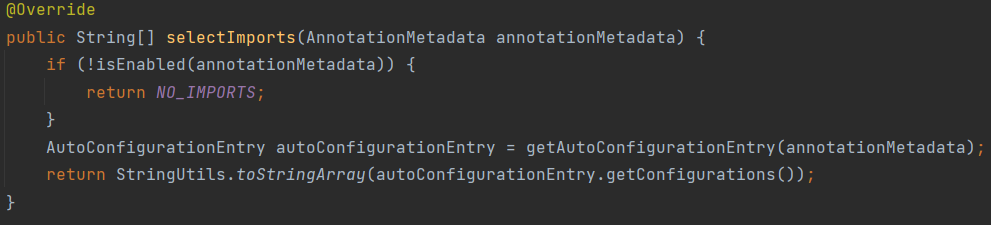

스프링 부트의 자동 설정 기능은 프레임워크에서 사용하는 기능들을 가장 보편적인 방법으로 미리 설정해서 사용자에게 제공합니다. 자동 설정의 핵심은 `@SpringBootApplication`에 포함되어 있는 `o.s.boot.autoconfigure.EnableAutoConfiguration` 애너테이션 입니다.

코드를 통해 자동 설정 클래스가 필요한 빈들을 애플리케이션에 등록하는 원리를 확인해 봅시다!

<figure markdown>
  
  <figcaption> 렛츠 고! </figcaption>
</figure>
---


먼저 @EnableAutoConfiguration의 코드를 살펴봅시다!
그 전에 ImportSelect 에 대해 정리한 [이 내용](ch06-sec00-@EnableXXX-and-bean-modulerlize#_4_)을 먼저 보고 오면 좋을것 같습니다. 

```java title="@EnableAutoConfiguration의 일부"
...
@AutoConfigurationPackage
@Import(AutoConfigurationImportSelector.class)
public @interface EnableAutoConfiguration{
	...
}
```

이 애너테이션에는 두가지 애위 애너테이션이 포함됩니다.

많이 복잡하지만 두 애너테이션의 역할을 최대한 구분 지어 생각하면 도움이 될것 같습니다.

### 1. @AutoConfigurationPackage

@AutoConfigurationPackage 는 빈을 직접 등록 한다기 보다는 추후 관리를 위해서 BeanDefinitionRegistry 에 Bean Definition 을 등록하는 과정이 필요한데 자동 설정 빈에 대해 이러한 작업을 수행해주는 `AutoConfigurationPackages.Registra`r 를 빈으로 등록해주는 역할을 합니다. `"AutoConfigurationPackages"` 를 Key 로 하고 `"자동 설정된 패키지의 basePackage 목록"`을 Value 로 하는 요소가 하나 `BeanDefinitionRegistry`에 추가되는 작업이 이루어 집니다.

### 2. @Import(AutoConfigurationImportSelector.class)

ImportSelector 에 대해 정리한 이전 글을 잘 떠올려 보면 
`@Import(AutoConfigurationImportSelector.class)`는 **어딘가에** 저장된 자동 설정 정보를 읽어  는 자동설정 대상이 되는 빈을 등록하는 역할을 합니다.

`ImportSelector` 인터페이스에서 가장 중요한 메서드는 Import 대상 설정 클래스의 목록을 리턴하는 `selectImports` 메서드입니다. `AutoConfigurationImportSelector` 의 `selectImports` 구현을 먼저 살펴보겠습니다.



`NO_IMPORTS` 는 상수로 정의된 빈 문자열 배열입니다.
애너테이션 메타데이터를 통해 enable 여부를 확인하고 활성화 되어 있지 않다면 빈 배열을 반환하고 활성화 되어 있다면 `AutoConfigurationEntry` 를 생성해 설정 목록을 문자열로 반환 합니다.

`AutoConfigurationEntry` 를 생성하는 코드를 따라가다 보면 자동 설정 클래스의 패키지 목록을 로딩하는 과정이있는데 이 과정이 가장 중요합니다. 그런데 SpringBoot 3.0.1 버전의 코드를확인해 보니 책과 조금 다른 부분이 있었습니다. 확인 해보니 2.7.0 버전에서 spring native 관련 작업을 하던 중 이슈가 발생해 더이상 autoconfiguration 목록을 spring.factory가 아니라 별도의 파일에서 import 하도록 수정이 있었습니다. ([관련 이슈](https://github.com/spring-projects/spring-boot/issues/29872))


`AutoConfigurationEntry` 생성 과정
1.  spring-boot-autoconfigure 의 jar 파일에 위치한 `META-INF/spring/org.springframework.boot.autoconfigure.AutoConfiguration.imports` 파일에 선언된 모든 자동 설정 클래스 목록을 로딩합니다.

2. AutoConfigurationImportFilter 에 따라 사용하지 않는 설정 클래스의 목록을 제거합니다.


3. 완성된 적용할 자동 설정 클래스의 이름 목록을 반환합니다.

AutoConfigurationImportFilter 는 Conditional 이라는 prefix 를 가지는 여러 애너테이션에 의해 설정 됩니다. 주로 다음 조건 들이 설정되어 있습니다.

- 특정 JAR 라이브러리가 클래스 패스에 포함되는지
	- `@ConditionalOnClass`, `@ConditionalOnMissingClass`
- 특정 스프링 빈이 있는지 여부
	- `@ConditionalOnBean`, `@ConditionalOnMissingBean`
- 프로퍼티 파일에 특정 변수 값이 있는지
	- `@ConditonalOnProperty`

