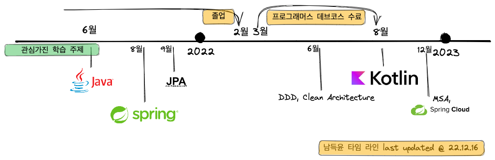

# 안녕하세요!
{ align=right width="200"}

*좋은 설계*와 *객체지향 방법론*에 관심이 많은 {==미래의 백엔드 개발자 남득윤==}입니다. 

저는 `하하` 라는 닉네임을 사용하고 오른쪽 이미지를 프로필 이미지로 자주 사용합니다.

 
 
 
 

## 좋아하는 것!
- 🦉 늦게나고 늦게 일어나는 것 
- ☕ 카페 공부
- :simple-youtube: 유튜브 시청

## 개발자로서 좋아하는 것!
- :octicons-code-16: 강의와 책을 바탕으로 학습한 내용을 코드로 풀어내는 것
- 🧑‍🤝‍🧑 그런 코드에 대해서 열정적인 동료와 열띤 토론을 하는 것!

## 저는 요즘 ...
- [코틀린 인 액션](http://www.yes24.com/Product/Goods/55148593) 이라는 책을 읽고 있습니다.

- 블로그 이사를 진행 중이에요 - [여기](https://ndy2.github.io//Haha-Blog/)
	- 한동안 [노션](https://www.notion.so/ndy-dev/60723b352f294580a98c2e2e8da9fbfa)을 주로 썻었는데 아무래도 개인 학습 정리하기에는 조금 더 가벼운 포맷이 좋을것 같아 Obsidian 을 이용해 보기로 했어요. mkdocs 와 조합해서 사용하니 블로그로 사용하기에도 좋을 것 같아. 이사를 결심하게 됬어요.
	- 그래도 모든 글을 옮기기 보다는 가장 많은 노력과 정성을 담은 글 몇개는 옮기기로 했어요. 너무 썰렁해 보여서 ㅜ.ㅜ

## 타임 라인
