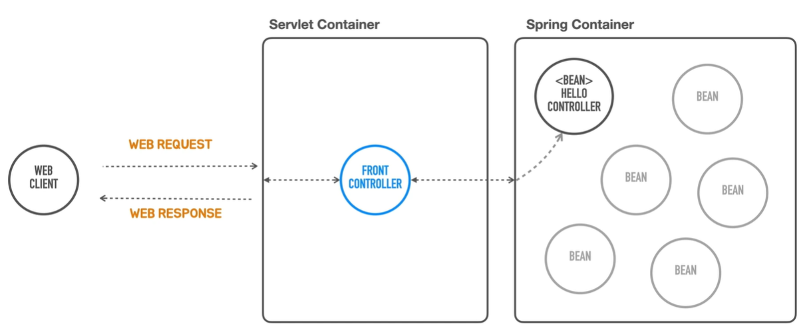

### 1. 스프링 컨테이너


스프링 컨테이너를 등장시키자!

스프링 컨테이너는 `Bean` 을 관리한다. 스프링은 Pojo Object 에 설정 메타 정보 (BeanDefinition)를 이용해 빈을 생성하고 스프링 컨테이너는 이들을 관리한다.


### 2. 코드

```java
package tobyspring.helloboot;  
  
import jakarta.servlet.http.HttpServlet;  
import jakarta.servlet.http.HttpServletRequest;  
import jakarta.servlet.http.HttpServletResponse;  
import org.springframework.boot.autoconfigure.SpringBootApplication;  
import org.springframework.boot.web.embedded.tomcat.TomcatServletWebServerFactory;  
import org.springframework.boot.web.server.WebServer;  
import org.springframework.boot.web.servlet.server.ServletWebServerFactory;  
import org.springframework.context.support.GenericApplicationContext;  
import org.springframework.http.MediaType;  
  
import java.io.IOException;  
  
@SpringBootApplication  
public class HellobootApplication {  
  
    public static void main(String[] args) {  
        GenericApplicationContext ac = new GenericApplicationContext();  
        ac.registerBean(HelloController.class);  
        ac.refresh();  
  
        ServletWebServerFactory serverFactory = new TomcatServletWebServerFactory();  
        WebServer webServer = serverFactory.getWebServer(context -> context  
                .addServlet("front-controller", new MyFrontController(ac))  
                .addMapping("/*"));  
        webServer.start();  
    }  
}  
  
class MyFrontController extends HttpServlet {  
    private final GenericApplicationContext ac;  
  
    public MyFrontController(GenericApplicationContext ac) {  
        this.ac = ac;  
    }  
  
    @Override  
    protected void service(HttpServletRequest req, HttpServletResponse resp) throws IOException {  
        HelloController helloController = ac.getBean(HelloController.class);  
  
        String name = req.getParameter("name");  
        String response = helloController.hello(name);  
  
        resp.setContentType(MediaType.TEXT_PLAIN_VALUE);  
        resp.getWriter().println(response);  
    }  
}
```

### 3. 스프링 컨테이너와 프론트 컨트롤러의 의의

- Front Controller 가 직접 컨트롤러를 생성하지 않는다. 
    - 싱글턴 패턴을 적용할 수 있다.
- Bean 간의 협력 구조를 통해 더욱 객체지향적인 설계가 가능하다.