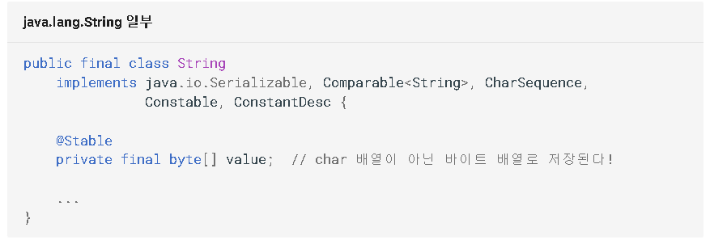
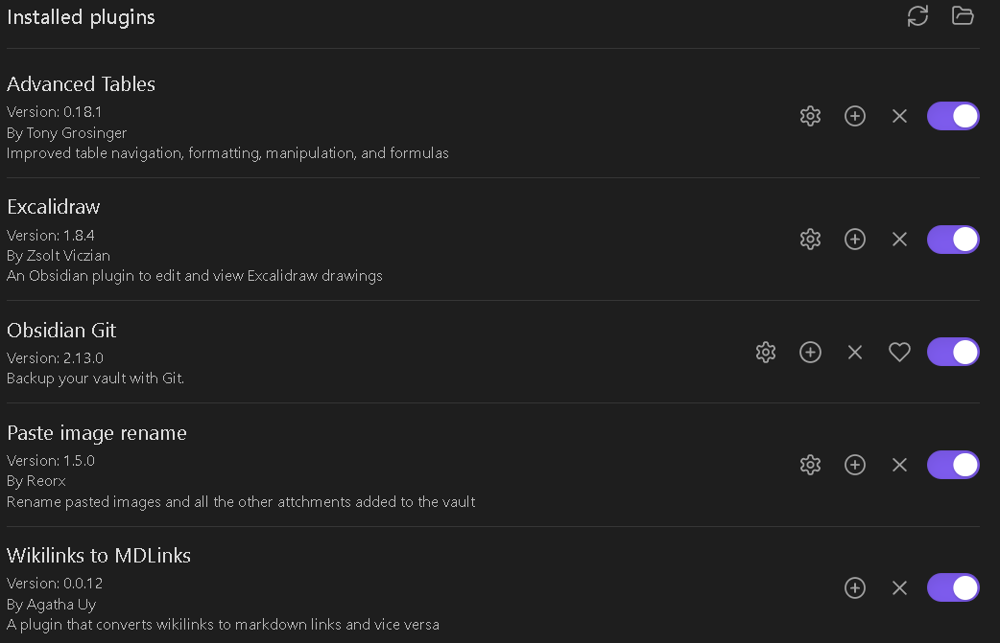
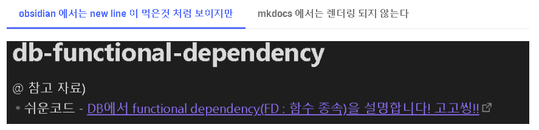

약 한달간 mkdocs-material 와 obsidian 을 이용해 요 블로그를 꾸며나가면서 느꼇던 이 방식의 장단점에 대해서 얘기해보겠습니다. 참고로 저는 jekyll 을 사용해본적이 없어서 jekyll 과의 직접적인 비교는 어려울것 같습니다.

### 1. 장점

#### 1.  마크다운 만을 이용함에도 문서의 표현력이 높다

아래의 방식들은 제가 자주 활용하는 표현 방식입니다. 이 외에도 [mkdocs-material 공식문서](https://squidfunk.github.io/mkdocs-material/reference)를 통해 다양한 표현방법을 확인 할 수 있습니다.

=== "코드 블락에 이름"

    
    일반적인 마크다운의 코드 블락 뿐만 아니라 코드블락에 이렇게 이름을 추가할 수 있습니다.

=== "탭 표현 (content tab)"

    
    가장 좋아하는 기능 중 하나입니다.
    글 뿐만 아니라 코드, 심지어 요 탭 처럼 이미지도 포함 할 수 있습니다. 

=== "글 상자 (admonitions)"

     
     다양한 아이콘을 사용할 수 있으며 상자의 접기 펴기 기능도 추가할 수 있습니다.
    아이콘의 커스텀도 가능합니다.

#### 2. mkdocs 의 다양한 플러그인과 마크다운 확장

`mkdocs.yml` 파일에 한줄 추가 하는 것 만으로 다양한 플러그인과 마크다운 확장을 사용할 수 있습니다. `pymdownx` 관련 확장을 통해 마크다운에 밑줄, 강조표시 등을 쉽게 추가 할 수 있고 `vegalite` 을 통해 다양한 그래프를 생성할 수 있습니다.

#### 3. obsidien의 다양한 플러그인

obsidian 에는 역시 수많은 유저들이 직접 개발한 커뮤니티 플러그인이 있습니다.

제가 사용하는 플러그인은 아래와 같습니다. 특히 `excalidraw` 는 혼자 사용했을때는 조금 불편함이 있었는데 이 플러그인을 통해 obsidian 에 완벽히 통합되어서 사용성이 매우 좋습니다.

#### 4. obsidian 의 커스텀 단축키 기능

obsidian 은 `vault` 별로 커스텀 단축키를 설정할 수 있습니다.

사용하는 IDE 와 비슷한 설정을 유지하여 obsidien에 적응하는데 큰 도움이 되었습니다.

#### 5. 감성? + 활발한 커뮤니티

mkdocs-material 과 obsidien 모두 플러그인을 통해 기능을 확장하고 깃을 통해 형상관리 하는것이 상당히 개발자 스러운 감성을 자극합니다. 또한 두 프로젝트 모두 현재 활발히 개발중이며 관련 커뮤니티가 활성화 되어있습니다. (물론 한국어 자료는 많지 않습니다.)

### 2. 단점

#### 1. Obsidien 에서는 허용하는 파일 형식 외의 파일을 수정할 수 없다

새로운 문서를 작성하거나 플러그인에 수정을 해야할 때면 `mkdocs.yml` 을 꼭 수정해야 하는데 그때 마다 메모장이나 vs 코드 등 다른 툴을 이용해야합니다.

`ini`, `csv` 타입의 파일을 obsidian 에서 관리하기 위한 플러그인이 존재합니다.
- ini - https://github.com/deathau/ini-obsidian
- csv - https://github.com/deathau/csv-obsidian

확인해보니 `csv-obsidian` 은 현재 동작하지 않고 `ini-obsidian` 은 사용할 수 있습니다. 모두 마지막 릴리즈가 2년전입니다 ㅜ.ㅜ

#### 2. mkdocs는 블로그가 아닌 문서 관리 툴

mkdocs 는 기본적으로 블로그가 아닌 마크다운을 이용한 문서화 툴입니다. 따라서 블로깅을 위한 기능들 (최신 포스트, 작성자 프로필, 일자별로 모아보기, 포스트에 태그 추가 ...) 은 지원되지 않습니다.

mkdocs-material 은 blog 플러그인을 통해 위 기능들을 제공하지만... **유료** 입니다 ㅜ.ㅜ

#### 3. 렌더링 차이

두 프로젝트가 문서를 렌더링 한 결과에는 차이가 있습니다.

=== "obsidian 에서는 탭 표현이 당연히 안되지만"

    

=== "mkdocs 는 가능하다!"

    

아래 처럼 obsidian 는 정상적으로 표현되었지만 
mkdocs 에서는 비정상적으로 렌더링 된 경우도 있습니다.

=== "obsidian 에서는 new line 이 먹은것 처럼 보이지만"

    

=== "mkdocs 에서는 렌더링 되지 않는다"

    

이런 문제를 확인 하기 위해서는 mkdocs 배포를 통해 화면을 확인하는 방법 밖에 없습니다. 깃헙 액션을 통해 화면을 확인하기 까지 길게는 5분 정도의 시간이 필요합니다.

점점 사용법에 익숙해지면 문제가 덜 느껴지겠지만 익숙해지기 까지는 큰 단점이라고 생각합니다. 혹은 mkdocs 환경을 로컬에 구축해서 화면을 확인하고 깃헙 CI 를 돌리는 방법도 있을것 같습니다.