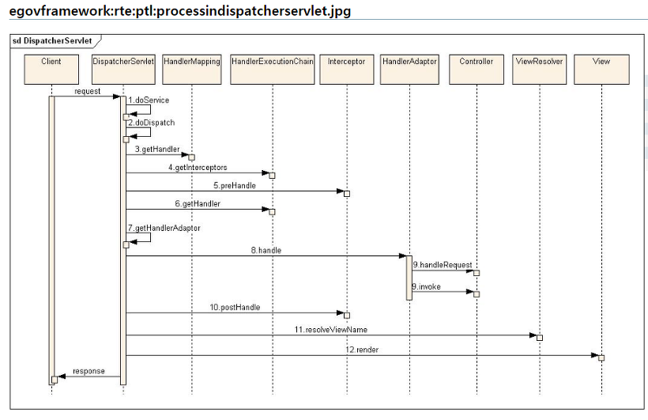

이번 절의 원래 주제는 Servlet Filter 와 Spring Interceptor 이지만 이 둘의 차이점과 동작 시점을 이해하기 위해서는 Dispatcher Servlet 의 요청 처리 흐름을 전반적으로 이해해야 합니다.

그래서 이 글에서는 바로 아래 순서도를 재 방식대로 이해하고 정리해보겠습니다.
아래 순서도의 전반적인 흐름은 이해하고 있지만 각 클래스의 이름과 역할에 대해 조금더 명확히 정리하는게 좋겠다 싶어 정리하게 되었습니다.


> 학습하다 발견한 그림인데 이 그림이 가장 깔끔하고 좋은것 같습니다.
위에 표시 되어 있다 싶이 전자정부 프레임워크의 그림 입니다. 근데 지금 코드를 따라가다 보니 그림이 스프링 프레임워크의 흐름과 살짝 다른 부분이 있는것 같습니다.
> 
> 위 그림에서는 인터셉터 목록을 직접 가져와서 preHandle 을 호출하고 HandlerAdapter 를 가져오는데 실제 o.s.web.servlet.DispatcherServlet 의 실행 흐름과는 살짝 다릅니다.
> 
> 또 `handlerAdpater` 가 요청을 하는 대상이 Controller 로 표현되어 있는 것도 스프링의 `DispatcherServlet과` 살짝 다른것 같습니다. 스프링에서는 Controller 가 아니라 `HandlerMethod` 를 핸들러 타입으로 사용합니다.  
> 
> 아래에서 자세히 살펴보겠습니다.


---

#### 1. doService
- `DispatcherServlet` 도 하나의 Servlet 으로 WAS 에 의해 동작하기 때문에 당연히 `javax(jakarta).servlet.Servlet` 를 상속하고 `doService` 를 호출함으로써 동작을 시작합니다.

- `DispatcherServlet` 은 `FrameworkServlet` 을 상속합니다.
- FrameworkServlet 은 HttpServletBean 을 상속하는 추상 클래스 로서 서블릿별 `WebApplicationContext를` 관리하고 `wac` 에 요청 처리 실패에 대한 이벤트 (`ServletRequestHandledEvent`) 를 발행하는 역할을 합니다.
- 또한 책에서 언급하는 중요한 내용으로 `FrameworkServlet` 은 `ApplicationContextAware` 를 구현하는데 그 내용은 마지막에 정리하겠습니다.

- `DispatcherServlet.doService` 는 간단히 `DispatcherServlet` 내에서 사용된 요청에 대한 attribute 를 세팅하고 `doDispatch` 에 그 요청을 위임합니다.


#### 2. `doDispatch`
핸들러로의 실질적인 dispatch 가 이루어집니다. 스프링 웹 MVC 가 요청을 처리하는 실질적인 진입점이라고 볼 수 있습니다.

핸들러 조회 및 실행, 사이 사이의 인터셉터 호출, 뷰 처리까지 모든 작업이 이 메서드에서 시작됩니다.

#### 3. `getHandler`
`DispatcherServlet` 은 `List<HandlerMapping> handlerMapping` 필드를 가지고 있습니다.
```java title="o.s.web.servlet.HandlerMapping"
public interface HandlerMapping {
	HandlerExecutionChain getHandler(HttpServletRequest request) throws Exception;
}
```

핸들러 매핑은 요청에 대해 `HandlerExecutionChain` 을 응답해줍니다. `HandlerExecutionChain` 은 
간단히 표현해서 아래와 같은 클래스입니다.
```java title="o.s.web.servlet.HandlerExecutionChain"
public class HandlerExecutionChain{

	private final Object handler;  
	private final List<HandlerInterceptor> interceptorList = new ArrayList<>();

	// 생략
}
```


`DispatcherServlet` 은 이 핸들러매핑 목록을 순회하며 요청에 대해 적절한 `HandlerExecutionChain` 을 조회합니다. 


#### 4. `getHandlerAdapter` -> `support`
DispatcherServlet 은 또한 `List<HandlerAdapter> handlerAdapters` 필드도 가집니다.
Spring 은 DispatcherServlet 과 Handler 가 강하게 결합되는 설계를 피하기 위해서인지 DispatcherServlet 이 직접 Handler 를 호출하는 것이 아니라 중간에 어댑터를 하나 두었습니다.

또한 `o.s.web.servlet` 패키지의 클래스내에 Handler 는 항상 `Object` 타입으로 표현하고 있습니다. 따라서 구체적인 Handler 의 타입에 따라 다를 수 있는 실행 로직은 `HandlerAdapter` 가 담당하게 하여 전형적인 어댑터 패턴을 적용한 사례입니다. 유연함과 확장성에 대한 스프링의 철학을 엿볼 수 있는 부분이라고 생각합니다.

핸들러 어댑터는 두가지 추상 메서드를 가지는 인터페이스 입니다.

```java title="o.s.web.servlet.HandlerAdapter"
public interface HandlerAdapter {
	boolean supports(Object handler); // (1)
	ModelAndView handle(HttpServletRequest request, HttpServletResponse response, Object handler) throws Exception;  // (2)
}
```

 1. 핸들러를 지원하는지 여부를 판별하는 support 메서드
 2. Object 를 handle 하는 `handle` 메서드


---

이쯤 되니 스프링이 기본적으로 등록하는 `HandlerMapping` 과 `HandlerAdapter` 를 살펴보고 싶어 졌습니다. 디버그를 통해 스프링이 기본적으로 등록하는 목록들 과 중요한 클래스 들을 살펴보겠습니다.

- `handlerMappings`


- `handlerAdapters`


두 목록의 첫번 째에 있는 `RequestMappingHandlerMapping` 과 `RequestMappingHandlerAdapter` 가 가장 중요하고 자주 사용되는 녀석이다. (사실 다른 녀석들을 사용할 일은 거의 없다.) 

- `RequestMappingHandlerMapping`
 @Controller 클래스에 선언된 @RequestMapping 메서드의 @RequestMapping 어노테이션에 선언된 정보를 바탕으로 핸들러 메서드를 찾아서 반환 해 줍니다.


- `RequestMappingHandlerAdapter`
`HandlerMethod` 타입의 핸들러를 support 하는 어댑터입니다.
`handle` 작업에서  argumentResolving, dataBinding 등의 추가 작업이 발생하고 `HandlerMethod` 를 실제 호출하여 그 결과를 `ModelAndView` 객체에 담아 반환합니다.


---

#### `5. preHandler`
mappedHandler (`HandlerExecutionChain`) 의 `preHandle` 을 호출합니다. 

#### `6. handle()`
handlerAdapter 에 의해 실질적인 handle 이 이루어 집니다.

일반적으로 사용되는 ha 객체는 `ReqestMappingHandlerAdapter`, Handler 객체는 `HandlerMethod` 타입입니다.

`HandlerMethod` 는 내부적으로 Controller bean 과 reflection 의 `Method` 객체 가지고 있습니다.
`ReqestMappingHandlerAdapter` 는 argumentResolving, dataBinding 등의 추가 작업을 하고 HandlerMethod를  `실행 할 수 있는 서블릿 핸들러 메서드 = ReqestMappingHandlerAdapter` 타입으로 바꾸어 실행하여 ModelAndView 결과를 반환합니다.

#### 7. `postHandle()`
mappedHandler (`HandlerExecutionChain`) 의 `postHandle` 을 호출합니다. 

`handle` 과정에서 예외가 발생한 경우 호출되지 않습니다.


#### 8. `viewResolving() and render()`

ModelAndView 객체에서 viewName 을 얻어 ViewResolver 를 통해 View 객체를 얻습니다.
response 객체에 view 를 담는 render 작업을 수행함합니다.

#### 9. `afterCompletion()`

마지막으로 render 까지 마무리된 응답에 인터셉터 목록의 `afterCompletion` 를 호출합니다.
이 인터셉터는 예외 여부와 상관없이 항상 호출됩니다.


> 후... 정말 기네요. 대략적으로 흐름만 이해하고 있었지만 정리를 통해 사용되는 실제 클래스의 이름에 조금더 친숙해진 것 같습니다.
