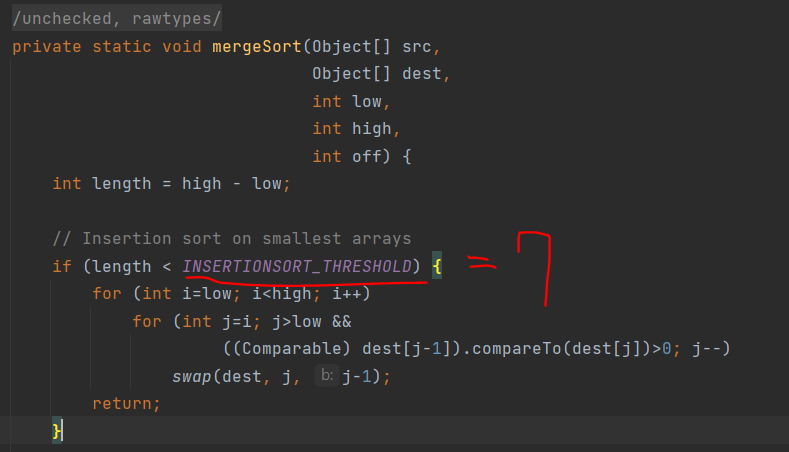

### 1. 병합 정렬 (Merge sort)

!!! note "병합 정렬!"

    * 병합 정렬<sup>Merge Sort/mergesort</sup>은 효율적이고, 범용적인 정렬 알고리즘 입니다.
    * 병합 정렬은 `divide-and-conquer` 알고리즘입니다.

### 2. 병합 정렬 코드

```python title="mergesort!" exec="true" source="material-block"
# Python program for implementation of MergeSort
def mergeSort(arr):
	if len(arr) > 1:

		# Finding the mid of the array
		mid = len(arr)//2

		# Dividing the array elements
		L = arr[:mid]

		# into 2 halves
		R = arr[mid:]

		# Sorting the first half
		mergeSort(L)

		# Sorting the second half
		mergeSort(R)

		i = j = k = 0

		# Copy data to temp arrays L[] and R[]
		while i < len(L) and j < len(R):
			if L[i] <= R[j]:
				arr[k] = L[i]
				i += 1
			else:
				arr[k] = R[j]
				j += 1
			k += 1

		# Checking if any element was left
		while i < len(L):
			arr[k] = L[i]
			i += 1
			k += 1

		while j < len(R):
			arr[k] = R[j]
			j += 1
			k += 1

# Code to print the list


def printList(arr):
	for i in range(len(arr)):
		print(arr[i], end=" ")
	print()


# Driver Code
if __name__ == '__main__':
	arr = [12, 11, 13, 5, 6, 7]
	print("Given array is", end="\n")
	printList(arr)
	mergeSort(arr)
	print("Sorted array is: ", end="\n")
	printList(arr)

# This code is contributed by Mayank Khanna

```

### 3. 병합 정렬 동작 흐름

![[images/mergesort.png]]

1. 나뉜 배열의 크기가 1이 될 때까지 재귀적으로 나눈다.
2. 합친다.

### 4. 병합 정렬의 특징

!!! note "성능"

    * Time Complexity : O(nlogn)
    * Auxiliary Spce : O(n) - 병합과정에서 보조 배열이 n 사이즈 만큼 필요하다.
    * Stable? : Yes!

!!! note "크기가 작은 배열과 병합 정렬"

    * 병합 정렬은 작은 크기의 배열에서는 효율적이지 않습니다.
    * 배열의 크기가 작은 경우 Insertion Sort 로 대체하면 더 효율적입니다. 배열의 크기가 43 ? 보다 작은 경우에는 Insertion Sort 의 연산 횟수가 더 적다고 합니다.
    * 
    * 근데 Java 의 과거에는 INSERTIONSORT_THRESHOLD 를 7 로 두고 있긴 합니다.

!!! note "메모리를 덜 쓰는 방법"

    MergeSort 의 단점중 하나는 O(n) 만큼의 추가적인 메모리를 필요로 한다는 점입니다. 이를 In-Place 에 수행하기 위한 많은 방법이 제안되었습니다.
    * [Wikipedia](https://en.wikipedia.org/wiki/Merge_sort#In-place_merge_sort)
    * 병합시에 메모리를 두 덩어리 중 작은 쪽의 사이즈 만큼만 사용할 수 있는 방법이 널리 활용되고 있습니다. (e.g. in Timsort [video example](https://youtu.be/HHN1axRRKx8?t=1160))

!!! note "LinkedList 와 병합정렬"

    * LinkedList 의 경우 병합정렬과 찰떡궁합입니다.
    * 추가적인 메모리가 필요하지 않고 Merge 연산의 중간에 데이터를 삽입하는 처리가 O(1) 타임에 수행 될 수 있기 때문입니다.
