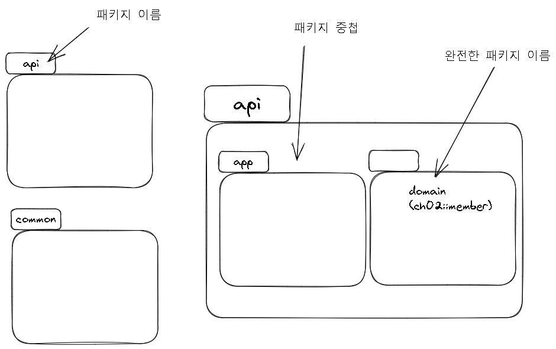
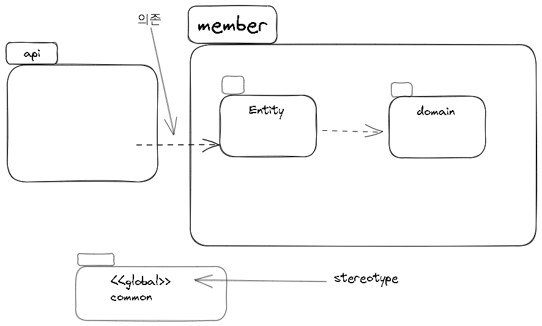

@참고 자료)

- 최범균님 - UML 기초 강의 on [Youtube](https://www.youtube.com/@madvirus)
- UML for Java Programmers by Robert C. Martin
    - 사실 이 책의 8 장에서도 패키지 다이어그램에 대해서 설명하는데 여기서 설명하는 UML 표기법이 그리 직관적이지 않다. nested package 를 표현하기 위해 ' 포함 관계 ' 화살표를 사용한다던가 패키지의 내용물을 목록 형태로 보여준다던가 하는 것이 그렇다. 그냥 직관적인 아래와 같은 다이어그램으로 익히고 사용하자.
- mermaid - package/namespace diagram
    - 지원하지 않는다.
    - 많은 사람들이 필요로 하는지 수많은 토론과 바운티 80$ 까지 걸려있다.
    - 그럼에도 최근에 컨트리뷰터로 자원했던 한 개발자 마저 assignee 에서 자기 정말 지원하면 좋겠다.`Contributor needed` Label 을 추가했다 T.T
    - [Issue - Add `package` to class diagram#1052](https://github.com/mermaid-js/mermaid/issues/1052)
---

### 패키지 다이어그램

- 패키지 : UML 의 구성 요소를 더 높은 수준에서 묶을 수 있는 단위
    - 다양한 다이어그램에서 활용 가능
    - 상위 수준 구조 분석에 용이

- 구성 요소를 포함하여 표현

- 패키지 간 관계 표현

- 패키지 간 상속 관계를 표현 할 수도 있다.

