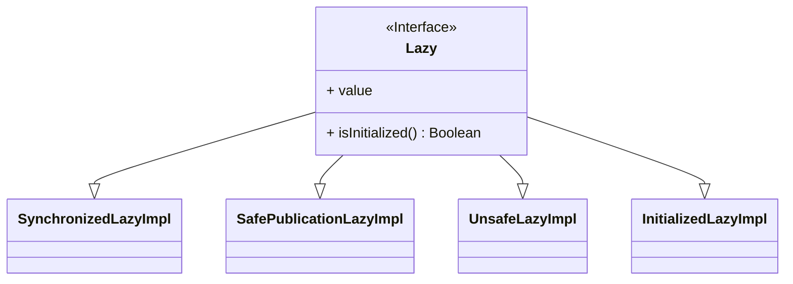

 

> [!quote] 참고 자료
> * [`『코틀린 인 액션』`](http://www.yes24.com/Product/Goods/55148593) by 드미트리 제메로프, 스베트라나 이사코바 
>     * 7 장 연산자 오버로딩과 기타 관례
> * kotlin documentation - [delegation properties](https://kotlinlang.org/docs/delegated-properties.html)
> * kotlin examples - [Delegation/DelegationProperties](https://play.kotlinlang.org/byExample/07_Delegation/02_DelegatedProperties)

---

### 1. 위임 프로퍼티

```kotlin
class Example { 
    var p: String by Delegate() // (1)
}
```

1. syntax : `val/var <property name>: <Type> by <expression>`

`by` 절 이후의 expression 을 *delegate* 이라고 부른다. 프로퍼티의 게터와 세터는 *delegate* 의 `getValue()`, `setValue()` 메서드에 위임처리된다.

```kotlin title="example Degegate"
import kotlin.reflect.KProperty 

class Delegate { 
    operator fun getValue(thisRef: Any?, property: KProperty<*>): String { 
        return "$thisRef, thank you for delegating '${property.name}' to me!"
    } 

    operator fun setValue(thisRef: Any?, property: KProperty<*>, value: String) { 
        println("$value has been assigned to '${property.name}' in $thisRef.") 
    } 
}
```

```kotlin title="delegated getter"
val e = Example() 
println(e.p) // (1)
e.p = "NEW" // (2)
```

1. result - `Example@33a17727, thank you for delegating 'p' to me!`
2. `NEW has been assigned to 'p' in Example@33a17727.`

### 2. Lazy Delegation

코틀린 표준 라이브러리는 유용한 형태의 `delegation` 팩토리 메서드를 몇가지 제공합니다. 먼저 [`lazy()`](https://kotlinlang.org/api/latest/jvm/stdlib/kotlin/lazy.html) 에 대해서 알아보겠습니다.

```kotlin
val lazyValue: String by lazy {
    println("computed!")
    "Hello"
}

fun main() {
    println(lazyValue)
    println(lazyValue)
}
```

```text title="실행 결과"
computed!
Hello
Hello
```

`get()` 이 처음 호출 되면 람다식을 실행해서 그 결과값을 `Lazy<T>` 인스턴스에 저장합니다.

`get()` 이 추가적으로 호출 되는 경우 람다식을 실행하지 않고 저장된 값을 반환합니다.

아주 매력적입니다. `lazy()` 의 구현을 더 자세히 살펴보겠습니다.

```kotlin title="LazyJVM.kt - kotlin.LazyKt"
package kotlin

public actual fun <T> lazy(initializer: () -> T): Lazy<T> = SynchronizedLazyImpl(initializer)

public actual fun <T> lazy(mode: LazyThreadSafetyMode, initializer: () -> T): Lazy<T> =  
    when (mode) {  
        LazyThreadSafetyMode.SYNCHRONIZED -> SynchronizedLazyImpl(initializer)  
        LazyThreadSafetyMode.PUBLICATION -> SafePublicationLazyImpl(initializer)  
        LazyThreadSafetyMode.NONE -> UnsafeLazyImpl(initializer)  
    }

public actual fun <T> lazy(lock: Any?, initializer: () -> T): Lazy<T> = SynchronizedLazyImpl(initializer, lock)

private class SynchronizedLazyImpl<out T>(initializer: () -> T, lock: Any? = null) : Lazy<T>, Serializable { /* 구현 구현 */ }

private class SafePublicationLazyImpl<out T>(initializer: () -> T) : Lazy<T>, Serializable { /* */ }
```

```kotlin title="Lazy.kt - kotlin.LazyKt"
package kotlin

public interface Lazy<out T> {  // (1)
    public val value: T  
    public fun isInitialized(): Boolean  
} 

@kotlin.internal.InlineOnly  
public inline operator fun <T> Lazy<T>.getValue(thisRef: Any?, property: KProperty<*>): T = value // (2)

public enum class LazyThreadSafetyMode {  // (3)
    SYNCHRONIZED,  
    PUBLICATION,  
    NONE,  
}

internal class UnsafeLazyImpl<out T>(initializer: () -> T) : Lazy<T>, Serializable {/* 구현 구현 */}

public fun <T> lazyOf(value: T): Lazy<T> = InitializedLazyImpl(value)

internal class InitializedLazyImpl<out T>(override val value: T) : Lazy<T>, Serializable {  /* 구현 구현 */ }
```

1. Lazy 인터페이스 - 저장 값의 게터와 초기화 여부를 제공합니다. 
2. *delegate* 로 동작하는 expression 은 `getValue` 를 제공해야 합니다. `Lazy<T>` 에 대한 `getValue` 연산자를 확장함수로 제공함으로써 Lazy 구현체가 delegate 로 동작 할 수 있습니다.
3. `lazy` 팩토리 메서드의 LazyThreadSaftetyMode 를 통해 세가지 타입의 Lazy 구현체를 제공합니다. 나머지 하나는 초기화가 다 되었다는 정보를 포함하는 `InitializedLazyImpl` 이므로 `lazyOf` 메서드로 따로 제공하고 람다를 받지도 않습니다.



기본적으로 활용되는 타입의 `Lazy` 구현체는 `SynchronizedLazyImpl` 입니다. 이 녀석의 가장 중요한 프로퍼티인 value 가 어떻게 오버라이드 되어 있는지 코드를 확인 해 보겠습니다.

```kotlin title="SynchronizedLazyImpl 일부"

@Volatile private var _value: Any? = UNINITIALIZED_VALUE

override val value: T  // (1)
    get() {  
        val _v1 = _value  
        if (_v1 !== UNINITIALIZED_VALUE) {  // (2)
            @Suppress("UNCHECKED_CAST")  
            return _v1 as T  
        }  
  
        return synchronized(lock) {  // (3)
            val _v2 = _value  
            if (_v2 !== UNINITIALIZED_VALUE) {  // (4)
                @Suppress("UNCHECKED_CAST") (_v2 as T)  
            } else {  
                val typedValue = initializer!!() // (5)
                _value = typedValue  
                initializer = null  
                typedValue  
            }  
        }  
    }
```

1. 프로퍼티 오버라이딩을 활용한 모습이 인상적입니다.
2. 초기화 되었다면 그 값을 반환
3. 그렇지 않다면 synchronized 블락에서 처리
4. 여기서 한번 더 확인 하는 모습도 인상적입니다.
5. function type 을 실행 한다. 여기서 `initializer` 의 값을 `null` 로 변경 해 주어서 이 구문이 단 한번만 실행 하도록 보장하는 모습이 인상적입니다.

### 3. Observable Properties

[`Delegates.observable()`](https://kotlinlang.org/api/latest/jvm/stdlib/kotlin.properties/-delegates/observable.html) 는 `초기 값` 과 `핸들러` 두가지 인자를 가집니다.

```kotlin
import kotlin.properties.Delegates

class User {
    var name: String by Delegates.observable("<no name>") {
        prop, old, new ->
        println("${prop.name} : $old -> $new")
    }
}

fun main() {
    val user = User()
    user.name = "first"
    user.name = "second"
}
```

```text title="실행 결과"
name : <no name> -> first 
name : first -> second
```

이번에는 게터 보다 세터와 조금더 연관이 깊은 *delegation* 입니다. `Delegates.observable` 은 setValue 연산자에 대한 오버라이딩을 제공하여 이전값, 현재값을 저장하고 있다가 값에 변경이 일어나는 경우 `Handler` 를 호출 할 수 있습니다.

*kotlin documentation* 에서 설명하는 내용 중 핸들러의 호출시점에 대해서는 꼭 알고가야할 것 같습니다. `Delegates.observable()` 의 핸들러는 값의 할당이 이루어 진 이후에 호출됩니다. 값의 할당이 이루어 지기 전 핸들러를 호출하는 *delegation* 인 [`Delegates.vetoable()`](https://kotlinlang.org/api/latest/jvm/stdlib/kotlin.properties/-delegates/vetoable.html) 이라는 녀석도 있습니다. 이녀석을 활용하면 값의 변경이 이루어지기 전 값을 검증하는 등의 역할을 수행 할 수도 있습니다. 

### 4. 컴파일러가 어떻게 처리하는가?

공식 문서 및 다양한 예제를 보면 위에서 정리한 `Lazy`, 나 `Delegation.observable()`, `vetoable()` 외의 몇가지 흥미로운 활용방식을 더 소개합니다.

> [!example] 다른 흥미로운 활용 방식들
> * [다른 프로퍼티에 위임](https://kotlinlang.org/docs/delegated-properties.html#delegating-to-another-property)
> * [맵에 위임](https://kotlinlang.org/docs/delegated-properties.html#storing-properties-in-a-map)
> * ...

위 방식들은 나중에 사용할 기회가 있으면 더 알아보는 것으로 하고 컴파일러가 이 위임 *Delegation* 을 어떻게 처리하는가에 대해서 알아보겠습니다.

사실 이전에 살펴본 [class 레벨의 delegation](../delegation) 에서 바이트코드 디 컴파일을 통해 어느정도 동작방식을 살펴보았습니다. 컴파일러는 위임 프로퍼티에 대해 보조 프로퍼티를 생성하여 이를 처리합니다.

```kotlin
class C { var prop: Type by MyDelegate() } 

// this code is generated by the compiler instead: 
class C { 
    private val prop$delegate = MyDelegate() // 보조 프로퍼티 생성
    var prop: Type 
        get() = prop$delegate.getValue(this, this::prop) // 게터 위임
        set(value: Type) = prop$delegate.setValue(this, this::prop, value) // 세터 위임 
}
```

기본적인 룰은 위와 같습니다. 컴파일러는 더 나아가서 최적화가 가능한 몇몇 경우에 보조 프로퍼티를 생성하지 않는 등의 최적화를 수행하기도 합니다.

---

### 5. `provideDelegate` 연산자

지금껏 `getValue` 와 `setValue` 연산자를 재 정의하여 *delegation* 을 제공하는 방법과 kotlin standard library 에서 제공하는 유용한 *delegation* 을 몇가지 알아보았습니다. kotlin 에는 delegation 와 관련된 연산자가 하나 더 있습니다. 바로바로 `provideDelegate` 입니다.

`lazy` 와 `Delegates.observable` 은 람다식을 통해 *delegation* 을 팩토리 메서드로 제공합니다. *delegation* 을 제공하는 클래스 자체를 구현하고 싶다면 `provideDelegate` 연산자를 오버로딩 할 수 있습니다.

```kotlin
class C { var prop: Type by MyDelegate() } 

// this code is generated by the compiler 
// when the 'provideDelegate' function is available: 
class C { 
    // calling "provideDelegate" to create the additional "delegate" property 
    private val prop$delegate = MyDelegate().provideDelegate(this, this::prop) // (1)
    var prop: Type 
        get() = prop$delegate.getValue(this, this::prop) 
        set(value: Type) = prop$delegate.setValue(this, this::prop, value) 
}
```

1. `MyDelegate` 은 `provideDelegate` 연산자를 오버로딩하여 `getValue` 와 `setValue` 연산자를 오버로딩 한 *delegate* 을 제공한다.

표준 라이브러리의 `PropertyDelegateProvider` 인터페이스를 통해 별도의 클래스 없이 위임 제공자를 생성할 수도 있습니다.

```kotlin title="게터만 재정의하는 Delegation 을 제공하는 위임 제공자."
val provider = PropertyDelegateProvider { thisRef: Any?, property -> 
        ReadOnlyProperty<Any?, Int> {_, property -> 42 } 
} 
val delegate: Int by provider
```
