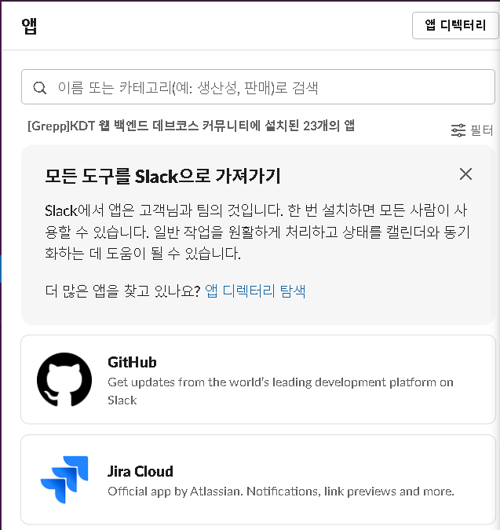

### Slack Image

### 1. 회원

!!! note ""

    애플리케이션을 이용하는 사용자

- 가입
- 로그인
- `워크스페이스`에 참여
- `워크스페이스` 전환
- 참여 중인 `워크스페이스` 목록 조회
    - 확인 하지 않은 메시지가 있는 `워크스페이스` 구분

### 2. 워크스페이스

!!! quote "What is Slack & Slack WorkSpace - [link](https://slack.com/help/articles/206845317-Create-a-Slack-workspace)"

   **Slack** is a channel-based messaging platform 
     
    **Slack workspace** is where people can 
    * work together
    * connect all their software tools and services
    * and find the information they need to their best work.

- 생성
- 삭제
- 병합
- 새 `멤버` 초대

- 멤버 목록 조회
    - 활동중인 멤버 구분

- `채널` 목록 조회
    - 확인 하지 않은 메시지가 있는 채널 구분

### 3. 멤버

!!! note ""

    멤버는 워크스페이스에 참여한 회원이다.

- `프로필`을 가진다. 
    - 프로필 이미지
    - 직함
    - 이름, 표시이름, 이름 발음 
    - 시간대 
    - 연락처 (이메일, 전화)
- 멤버별 `역할` 을 가진다.
    - 워크스페이스 관리자
    - 워크스페이스 소유자
    - 워크스페이스 게스트 ...
- 상태
    - 온라인/오프라인

- `채널`/`DM`/`App` 을 추가 할 수 잇다.

- `방해 금지 시간` (DND 시간) 설정

- `허들` (비디오 회의)를 시작/종료/참여/퇴장 할 수 있다.
- `멘션`된 메시지에 대한 `알림`을 확인할 수 있다.
    - 온라인 이라면 라이브 알림/ 오프라인 이라면 알림 카운트

### 4. 채널

!!! note "What is a channel - [link](https://slack.com/help/articles/360017938993-What-is-a-channel)"

    Slack organizes conversations into dedicated spaces called channels. Channels bring order and clarity to work — you can create them for any project, topic, or team. With the right people and information in one place, teams can share ideas, make decisions, and move work forward.

- `채널` 은 `사용자` 목록을 가진다.
- `채널` 에서 `바로가기` 를 확인 할 수 있다.
    - 바로가기 = `고정한 메시지` + `북마크` 목록
    - `책갈피(a.k.a.북마크)` 목록을 가진다.
    - 북마크는 `폴더`를 통해 관리될 수 있다.
- `회원` 은 `채널` 에 `메시지` 를 전송할 수 있다.
- `회원`은 `채널` 에서 `허들`을 시작할 수 있다.
- `채널`은 `Public/Private` `채널` 으로 구분된다.
    - public - 모든 `멤버`가 이용가능
    - private - 지정된 `사용자`만 이용가능

### 5. 다이렉트 메시지 (DM)

- `멤버` 는 `워크스페이스`에 속한 다른 `멤버`와 *1:1* 혹은 *그룹*으로 대화 할 수 있다.
- `멤버`는 `DM` 에서 `허들` 을 시작할 수 있다.

### 6. 앱

- `멤버`는 `앱`을 `워크스페이스`에 설치할 수 있다.

### 6. 메시지

- Content
    - 텍스트 (이모지, 간단한 폰트 적용 가능)
    - 이미지
    - 비디오
- 메시지 `예약 전송`

### 7. 허들

- `채널` 이나 `DM` 에서 시작 수 있다.
- 음성/화상 기반의 회의 서비스이다.

- `화면 공유`할 수 있다.
    - 여러 `멤버`가 동시에 `화면 공유` 할 수 있다.
    - `낙서` 할 수 있다.

- `멤버` 는 동시에 두개 이상의 `허들` 에 참여할 수 없다.