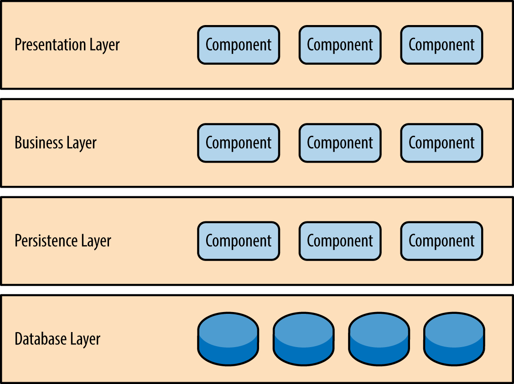

@ 참고 자료)
- 데브원영 - [[마틴 파울러] 소프트웨어 아키텍처의 중요성 (한글 자막)](https://youtu.be/4E1BHTvhB7Y)
- 톰 홈버그 - `만들면서 배우는 클린 아키텍처`
- 인프런/한정현 - `실무에서 전하는 따끈한 마이크로서비스 아키텍처(MSA) 이야기` 

### 0. 들어가며

톰 홈버그의 `만들면서 배우는 클린 아키텍처` 에서 처음 접하였고 흥미를 느껴 개인적으로 여러번 적용해 보았고 나름 애정(?) 을 가지고 있는 아키텍처입니다. 육각형 아키텍처의 일반적인 내용에 대한 정리와 제 경험에 따른 생각을 정리해보겠습니다.

---

### 1. 아키텍처 그리고 전통적인 계층형 아키텍처

#### 1. 마틴 파울러 - 아키텍처란?

육각형 아키텍처를 이야기하기전 먼저 아키텍처에 대한 간단한 정의가 필요합니다. 마틴 파울러의 아키텍처에 대한 정의는 아래와 같습니다. 위 링크의 영상을 참고하시면 이해가 훨씬 수월합니다.

> 아키텍처는 뭔가 중요한 것 (Some Important Stuff) 이다.
 
참 난해합니다. 조금 더 풀어서 설명하면 아래와 같습니다.

> 아키텍처란 지식을 공유하는 것 (Shared understanding) 이고 또한 바꾸기 어려운 것 (Hard to change) 이다. 이를 합치면 뭔가 중요한 것 (Important Stuff) 이다.

조금 더 풀었는데도 여전히 난해하기만 합니다.

마틴 파울러가 이후에 이야기 하는 아키텍처가 중요한 이유를 참고해서 이해하면 조금 이해가 더 됩니다. 

> 아키텍처가 중요한 이유는 이를 신경쓰지 않을 때 나중에 더 힘들어지기 때문이다.

마틴은 경제적인 관점에서 아키텍처의 중요성을 강조하며 아래의 그래프로 이를 설명합니다.

[Design Stamina Hypothesis](https://martinfowler.com/bliki/DesignStaminaHypothesis.html)

이 그래프는 좋은 아키텍처 (디자인)를 가지고 있으면 초기에는 개발속도가 느리지만 일정 시점 (Design payoff line) 이후에도 기능을 추가하는 속도가 항상 선형적일수 있다는 것을 보여줍니다. 마틴은 자신의 저서인 `리팩토링` 에서도 이 그래프를 언급하며 리팩토링을 하는 이유 역시 좋은 Design 을 유지하여 기능 추가에 따른 코스트를 선형으로 유지하기 위함이라고 하였습니다.

정리하자면 아키텍처란 `개발을 일정한 속도로 할 수 있도록 해주는 뭔가 중요한 것` 입니다.

물론 이런 정의에도 논쟁의 여지가 있고 다른 정의방식 역시 많지만 개인적으로 가장 와닫는 방식입니다.

---
그런 아키텍처에는 크게 컴포넌트 (마이크로서비스) 내부 아키텍처와 외부 아키텍처가 있습니다. 오늘 이야기할 `계층형 아키텍처`와 `육각형 아키텍처`는 그 중 내부 아키텍처의 한 종류입니다.

#### 2. 계층형 아키텍처

- 마이크로서비스의 내부 구조를 계층형으로 구성.
- 호출은 위에서 아래로, 아래에서 위 호출 불가

계층형 아키텍처는 간단하지만 레이어간 호출방향에 대한 룰 외에는 정해진 룰이 없어서 확장성 측면에서 불리합니다. 특히 도메인별 참조와 컴포넌트의 너비 (Width) 에 대한 룰을 정하지 않아 흔히 이야기 하는 스파게티 코드가 되기 쉽상입니다. 

JPA 와 같은 ORM 과 결합하여 사용했을 때는 영속성 레이어가 가장 아래 있다는 점 때문에 데이터 중심적인 설계로 이어지기 쉽다는 점도 계층형 아키텍처의 단점입니다. 데이터 중심적인 설계는 MSA에 적합하지 않습니다.

그렇게 Clean Architecture 와 Hexagonal Architecture 가 등장하였습니다.

---

### 2. Hexagonal Architecture[]

