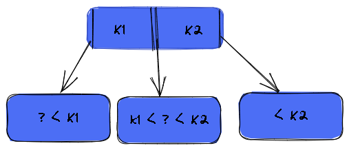

@ 참고 자료)

- 쉬운코드 -  https://youtu.be/bqkcoSm_rCs
- B-Tree Visualization - https://www.cs.usfca.edu/~galles/visualization/BTree.html

---

### 1. B-Tree 는 확장된 BST!

- 자녀 노드의 개수를 여러개 가질 수 있다.
- 최대 몇개의 자녀 노드를 가질 것인지는 B-tree 의 가장 중요한 파라미터

---

### 2. B-Tree 의 파라미터

- `M` - 각 노드의 **최대** 자녀 노드 수 (Max. Degree)
- `M - 1` - 각 노드의 **최대** Key 수 
- `ceil (M/2)` - 각 노드의 **최소** 자녀 노드 수 (:warning: root-node, leaf-node 제외)
- `ceil (M/2) - 1` - 각 노드의 **최소** Key 수 (:warning: root-node)

---

### 3. B-Tree 의 규칙

!!! note ""

    internal-node 의 key 가 x 라면 자녀 노드의 수는 항상 x+1 개이다.

- Rule violation

- 따름 규칙
    - `M`과 관계없이 internal-node 는 **최소** 두 개의 자녀는 가진다.
    - `M`이 정해지면 internal 노드는 **최소** `ceil(M/2)` 개의 자녀 노드를 가질 수 있게 된다.

### 4. 데이터 삽입

- 추가는 항상 leaf 노드에 한다
- 노드가 넘치면 가운데 (median) key 를 기준으로 
   좌우 key 들은 분할하고 가운데 key는 승진한다.

- 영상을 보자! ( M = 3 인 경우 )
<iframe width="341" height="240" src="https://www.youtube.com/embed/bqkcoSm_rCs" title="(1부) B tree의 개념과 특징, 데이터 삽입이 어떻게 동작하는지를 설명합니다! (DB 인덱스과 관련있는 자료 구조)" frameborder="0" allow="accelerometer; autoplay; clipboard-write; encrypted-media; gyroscope; picture-in-picture; web-share" allowfullscreen></iframe>

- pesudocode 도 보자!  ( M = 4 인 경우) 
    - https://www.cs.utexas.edu/users/djimenez/utsa/cs3343/lecture17.html

### 5. B tree 의 특징

!!! note ""

    B-tree 는 AVL Tree (Auto Balancing Tree) 이다.

