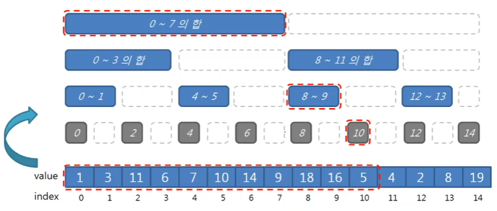

@ 참고 자료)

- 개발자 영맨 - [[Range Sum] 구간 합 #2 - Binary Indexed Tree (Fenwick Tree)](https://www.youtube.com/@bluedawnstar)

### 1. Range Query - O(logn)

- 끝자리가 겹치지 않는다.
- sum(0,10) = BIT[0] + BIT[8] + BIT[10] + BIT[11]
    - 11 = 010112
    - 10 = 010102
    - 08 = 010002
    - 00 = 000002
- 이런 식으로 동작하도록 구현된 트리!

### 2. Point Update - O(logn)

- update(4, delta)
    - BIT[5] += delta  // 5 = 001012 (-> + 12)
    - BIT[6] += delta  // 6 = 001102 (-> + 102)
    - BIT[8] += delta  // 8 = 010002 

### 3. Range Update

{==TODO!==}