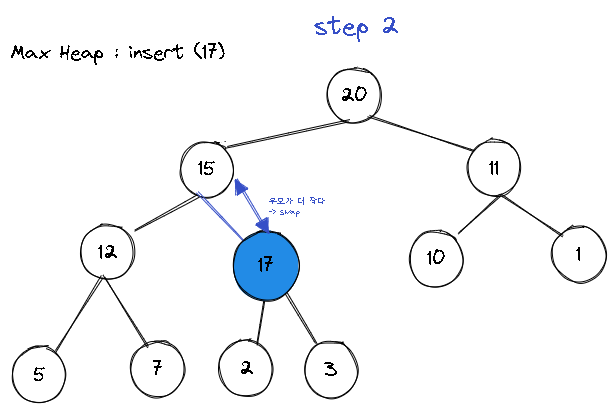
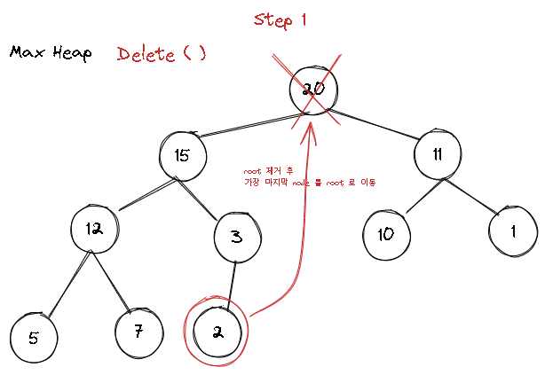
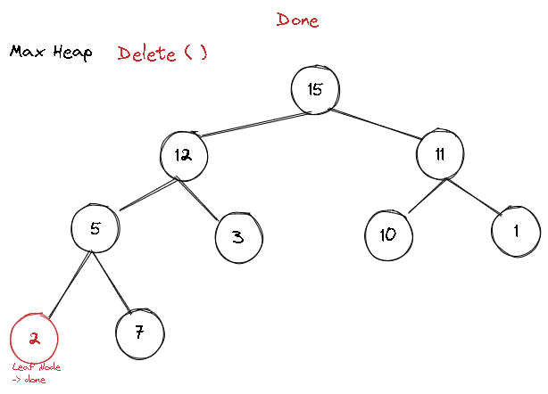

@ 참고 자료)

- `쉬운코드 (@ez.)` - [우선순위 큐와 힙의 개념과 차이...](https://youtu.be/P-FTb1faxlo)

---

### 1. Priority Queue

#### 1. 개요

!!! note "Priority Queue"

    Queue 와 유사하지만 Priority 가 높은 아이템이 먼저 처리됨
    Priority Queue 는 구체(?) 자료 구조가 아닌 추상 자료 구조임

### 2. 주요 동작

- `insert`
- `delete (poll)`
- `peek`

### 3. 특징

- Queue 이지만 FIFO 라고 볼 수는 없다
- CPU 스케쥴링에서 사용된다. ( ~-> Multilevel Feedback Queue)
- Heap Sort 에 사용한다 - 모든 데이터를 Heap 에 삽입하고
- Heap 메모리의 Heap 과는 크게 관련이 없다.

### 2. Heap

#### 1. 개요

!!! note "Heap"

    * Priority Queue 를 구현하는 자료구조
    * Heap 의 Key 를 우선순위로 사용 하면 Heap 은 Priority Queue 의 구현체가 된다.
    * Heap 은 주로 완전 이진 트리 기반 (Complete Binary Tree) 으로 구현한다.

#### 2. 종류

- Max Heap 과 Min Heap 이 있다.

![[excalidraws/heap.excalidraw.png]]

#### 3. Insert

위 Max Heap 에 17 을 추가하는 과정을 살펴보자.

=== "Step 1"

    

=== "Step 2"

    

=== "Step 3"

    

=== "완료"

    

#### 4. Delete

기존 Max Heap 에 Delete 연산을 처리하는 과정을 살펴보자

=== "Step 1"

    

=== "Step 2"

    

=== "Step 3"

    

=== "Step 4"

    

=== "완료"

    

### 5. 시간 복잡도

- `insert` -> `O(log n)`
- `delete` -> `O(log n)`
- `peek` -> `O(1)`

최대 Tree 의 높이 만큼의 비교가 발생하기 때문에 O(log n) 타임에 삽입, 삭제 연산을 처리 할 수 있다.