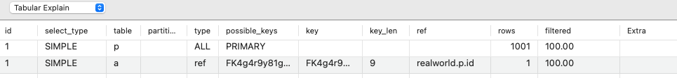

@참고 자료)
MySQL - [explain-output](https://dev.mysql.com/doc/refman/8.0/en/explain-output.html)

---

### 0. 들어가며

- `친절한 SQL` 을 읽다보니 oracle 에 기반한 책이라는 점이 아쉬웠습니다.
- 사실 MySQL 을 깊게 학습한 적이 있는 것은 아니라 이 기회에 Oracle DB 로 계속 학습을 이어나가면 어떨까도 생각했지만 여러 대기업에서 MySQL 을 적극적으로 사용하고 있다고 생각되어 계속 MySQL로 학습하고자 합니다.

- 책에서 나오는 내용을 MySQL 로 따라해보려하니 가장 막히는 부분이 실행 계획을 읽는 부분이었습니다
- 그래서 이 문서에서는 MySQL 의 Execution Plan 을 확인하고 해석하는 법을 간단히 정리해보고자 합니다.

- 예시로 사용한 테이블 구조와 쿼리는 이전에 진행했던 프로젝트 중 하나인 [리얼월드](https://github.com/ndy2/realrealworld) 의 테이블 구조와 쿼리를 사용하겠습니다. 자세한 테이블 구조가 궁금하신 분은 위 링크를 참고해주세요.

- 모든 항목을 정리하지는 않고 프로젝트에서 사용한 쿼리의 실행계획을 찍어보았을때 보이는 특이사항 위주로 정리하겠습니다.
---

### 1. 전체 테이블을 찍는 쿼리

빈 값들은 `Null` 입니다. 일단 값이 있는 필드 먼저 살펴보겠습니다.

- `id`
	- `SELECT` 연산의 식별자입니다.
	- 위 쿼리의 실행계획은 SELECT 가 단 한번만 호출 되므로 하나의 row 를 가지고 있습니다.

- `select_type`
	- SELECT 연산의 종류입니다.

- `type`
	- join type 입니다.
	- `ALL` 은 full table scan 을 수행한다는 의미이며 일반적으로 피해야하는 신호입니다.

- `rows`
	- 현재의 쿼리 값으로 조회를 수행하는 rows 의 개수를 의미합니다.
	- 이는 MySQL 이 통계적으로 판단한 값이며 정확하지 않을 수 있습니다.

- `filtered`
	- 조회한 row 중 `WHERE` 절 필터링을 통해 남는 row 의 비율입니다.
	- 즉 rows * filtered / 100 값이 결과의 예상 row 수 입니다.

MySQL 의 기본 Explain 키워드 만으로는 실행계획을 이해하기 어렵습니다.

format="json" 을 통해 더 자세한 정보를 확인하거나 MySQL workbench 를 이용해 GUI 를 통해 실행계획을 확인할 수 있습니다. MySQL workbench  의 번개 + 돋보기 아이콘을 클릭하면 선택한 쿼리의 Explain 키워드를 실행한 결과를 Tabular 형식과 `json` 포멧을 통한 시각화 형태로 확인 할 수 있습니다.

- 1.000 K rows 에 대해서 Full Table Scan 을 사용할 것이란 것을 알 수 있습니다.

### 2. 카운트 쿼리

- 전체 아티클의 카운트를 조회하는 쿼리의 실행계획을 확인해보겠습니다.

 
- 실행 계획 visualize
 

- Full Index Scan 방식을 활용한다는 것을 알 수 있습니다.
- 이때 대상 인덱스는 a.FK4g4r0.... 입니다.

 
- USE INDEX 를 사용해 Primary Key 인덱스를 사용하도록 힌트를 주면 실행 계획이 아래와 같이 바뀝니다.

- a.PRIMARY 인덱스를 활용하는 것이 실행 계획에 잘 반영되었습니다.

### 3. Join 쿼리

- 실행 계획
-

- 이걸 어떻게 해석해야될까요?
- p 와 a 테이블을 NL 조인을 수행하는데 p 테이블에서는 Full Table Scan 을 a 테이블 에서는 `FK4g4r...` 인덱스에대해서 Non-Unique Key Lookup 방식을 활용한다고 해석하면 될것 같습니다.

- 저 인덱스는 article 테이블에서 profile 테이블에 대해 물고있는 author_id 외래키에 대한 인덱스입니다.
- Article 을 왼쪽에 Profile 을 오른쪽에 작성했지만 MySQL 이 똑똑하게 Profile 을 NL 조인의 Driving Table 로 설정한 것 같습니다.
 
이번에는 힌트를 통해 join 순서를 강제해보겠습니다.

MySQL 8.0 에 추가된 힌트인 `/*+ JOIN_FIXED_ORDER () */` 구문을 활용하면 from 절의 순서대로 join 순서를 강제할 수 있습니다. 실행계획 도 바뀐것을 확인 할 수 있습니다.

