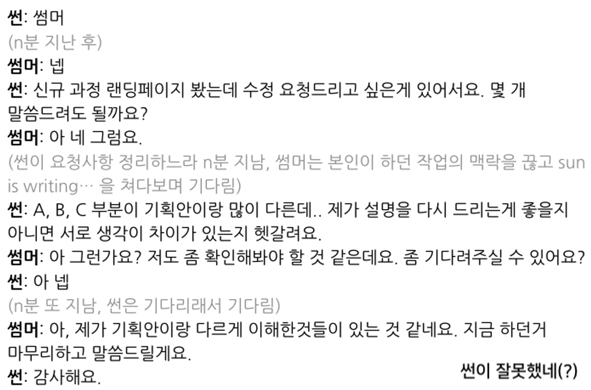

@ 출처)

- 프로그래머스 데브코스 中 스펜서의 글
---

# 비동기적 커뮤니케이션

### 🤔비도..동기?

**비동기적 커뮤니케이션** 의 특징은 이렇습니다.

-   메시지 수신자가 지금 바로 답을 할 수 있건, 없건 신경쓰지 않아요.
-   이름 부르고 안 기다립니다. 요청사항, 용건을 한 번에 보냅니다.
-   대답을 바로 받아야만 일을 진행할 수 있는 상황을 만들지 않습니다.
-   멘토, 강사님들은 현직 개발자들입니다!
    -   때문에 비동기적 커뮤니케이션은 필수겠지요?!

### **🤷‍♀️비동기적 커뮤니케이션이 어려울 때**

물론, 비동기적 커뮤니케이션이 어려운/불가한 때가 있습니다.예컨대 이럴 때 그렇겠죠.

-   **급한 이슈**가 생겨서 당장 뭉쳐야 할 때
-   **빠르게 대응해야 하는 외부의 요청**(강사, 스터디 리더, 스터디원, …)이 있을 때

그 외의 일상적인 업무 상황에서는 항시 비동기적 커뮤니케이션을 유지합니다.이를 통해 각자의 업무 맥락이 갑자기 끊기는 상황을 최대한 방지합니다.

### **🙄잠깐! 오해하지 말아요**

여기까지 읽다보면 동기적 커뮤니케이션을 절대 하지 말라는건가... 라는 생각이 들겠지만, 아닙니다! 커뮤니케이션 방법을 하나로 굳히자는 것도 아닙니다.

-   업무 맥락을 최대한 끊지 말고
-   충분히 비동기적으로 할 수 있는 업무임에도 불구 동기적으로 진행하여 서로의 시간이 묶이고, 의존성이 커지는 상황을 방지

하는 것이 핵심입니다. 당연히 필요할 때는 동기적으로 할 수 있어요. 하자고 하면 됩니다. 극단적으로 치우쳐질 필요는 없어요.

**실제 예시**를 통해, 비동기적 커뮤니케이션과 동기적 커뮤니케이션의 사례를 보도록 하겠습니다.

**사례1 : 동기적커뮤니케이션**

**사례2 : 비동기적 커뮤니케이션**

