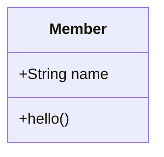
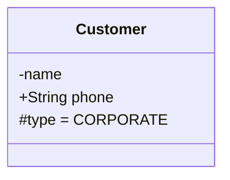
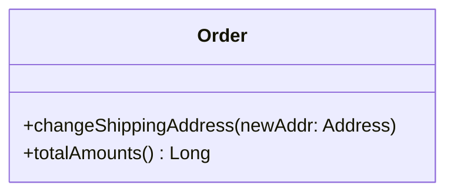
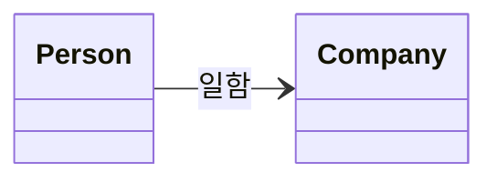
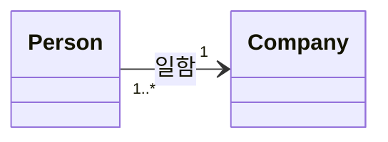
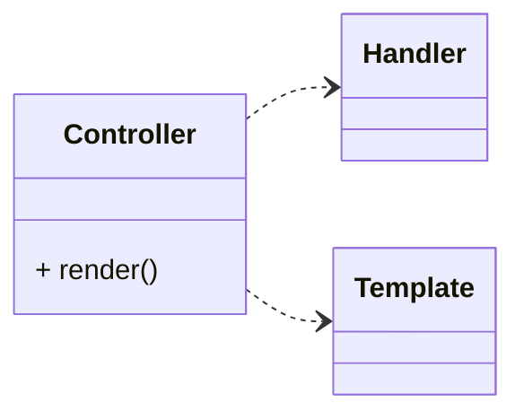
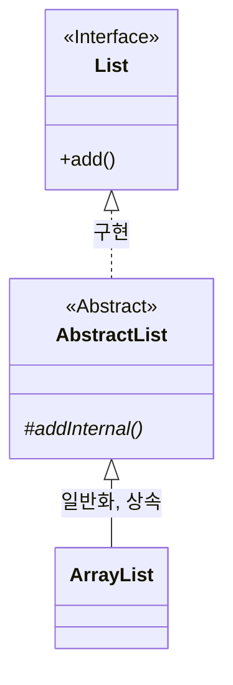
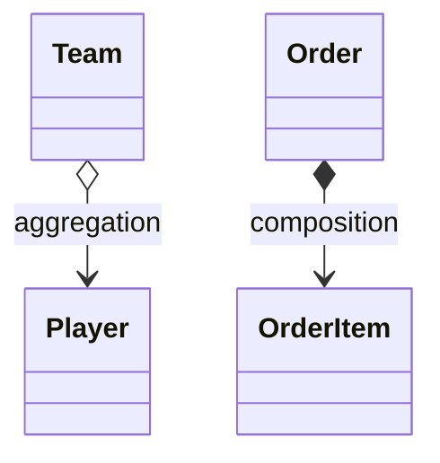

@참고 자료)

- 최범균님 - UML 기초 강의 on [Youtube](https://www.youtube.com/@madvirus)
- UML for Java Programmers by Robert C. Martin 
---

### 클래스 다이어그램

- 객체의 타입을 표현
- 타입 간의 정적인 관계 기술
- 클래스 이름/속성 (attribute)/ 오퍼레이션 (operation) 으로 세칸으로 구분
- 클래스 이름만 필수로 나머지는 필요한 것만 표시 가능



```text title="in mermaid.js"
classDiagram
    class Member{
        +String name
        +hello()
    }

// or

classDiagram
class Member
Member : +String name
Member : +hello()
```

---

### 속성 표기법

- `가시성 이름 : 타입 = 기본갑`
- 가시성 `+ public`,  `- private`,  `# protected`,  `~ package`


```text title="in mermaid"
classDiagram
    class Customer{
        -name
        +String phone
        #type = CORPORATE
    }
```


### 오퍼레이션 표기법

-  가시성 이름(매개변수 목록) : 리턴타입


```text title="in mermiad"
classDiagram
class Order {
    +changeShippingAddress(newAddr: Address)
    +totalAmounts() Long
}
```

### 연관 (association)

#### association with label


```text title="in mermaid"
classDiagram
    direction LR
    Person -->Company : 일함
    class Person
    class Company
```

- mermaid syntax - `[classA][Arrow][ClassB]:LabelText`

#### association with cardinality


```
classDiagram
    direction LR
    Person "1..*" --> "1" Company : 일함
    class Person
    class Company
```
- `[classA] "cardinality1" [Arrow] "cardinality2" [ClassB]:LabelText`


#### 연관 탐색

- 연관(실선)의  화살표는 연관의 탐색 가능 방향을 의미
- 양쪽에 모두 지정하지 않으면 양방향 탐색 가능

### 의존 (Dependency)

- 변경에 의한 전파 가능성을 의미
- 점선(..>)으로 표시



```text title="in mermaid"
classDiagram
    direction LR
    Controller ..>Handler
    Controller ..>Template
    class Controller{
        + render()
    }
    class Handler
    class Template
```

### 인터페이스, 추상 클래스



```text title="in-mermaid"
classDiagram
    List<|..AbstractList : 구현 
    AbstractList<|--ArrayList : 일반화, 상속

    class List{
        <<Interface>>
        +add()
    }
    class AbstractList{
        <<Abstract>>
        #addInternal()*
    }
    class ArrayList
```

### aggregation, composition

- 마름모꼴로 표현
- aggregration - 집합
    - 부분/전체 관계를 내포하는 연관의 특별한 형태
    - 색이 칠해져 있지 않음
- composition - 합성
    - 집합의 특별한 형태 (사실 큰 차이 없을 지도?) 조금 더 긴밀한 관계를 의미
    - 색이 칠해져 있음



```text title="in mermaid"
classDiagram
    Team o--> Player : aggregation
    class Team 
    class Player

    Order *--> OrderItem : composition
    class Order 
    class OrderItem
```


