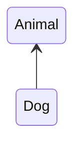

@참고 자료)

- 최범균님 - UML 기초 강의 on [Youtube](https://www.youtube.com/@madvirus)
- UML for Java Programmers by Robert C. Martin 
---
### 1. UML

- UML - Unified Modeling Language
- 그래픽 표기법
- 여러 다이어그램 정의
    - 클래스D, 패키지D, 객체 D, 액티비티 D, 컴포넌트 D, 배치 D, ...
- 소프트웨어 시스템 표현, 설계에 사용한다.
- 의사소통 도구로 활용하기에 좋다.

---

### 2. 개념/명세/구현 차원

#### 개념 차원의 다이어그램

개는 동물이다. (A dog is an animal)



- 사람의 언어와 더 관련 있다.

#### 명세/구현 차원

```java
public class Animal {}
public class Dog extends Animal {}
```


### 3. 다이어그램의 유형

- 정적 다이어그램
- 동적 다이어그램
- 물리적 다이어그램

### 4. 모델이 필요한 이유

- 항공우주 산업이나 건축 도시계획 산업에 비해 소프트웨어 분야에 모델이 필요한 이유를 명확히 제시하기는 어렵다.
- UML 을 작성하고 코드를 작성하는 것이 바로 코드를 작성하는 것 보다 시간/ 비용관점에서 항상 좋다고 말하기 어렵다.
- 그럼에도 UML 을 효과적으로 사용해야하는 순간, 사용할 수 있는 이유는 다음과 같다.

1. 다른 사람과 의사 소통을 위해
2. 대규모 소프트웨어 구조의 로드맵을 만들때 유용하다.
3. {==간결한==} 백엔드 문서를 만들때 유용하다.


!!! warn

    * 절대 다이어그램을 그려야 해서 그리지 마라.
    * 다이어그램을 안 그린다고 죄책감을 느낄 필요없다.
