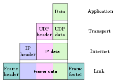

@ 참고 자료)

- wikipidia
	- [Internet Protocol](https://en.wikipedia.org/wiki/Internet_Protocol)
	- [Internet Protocol version 4](https://en.wikipedia.org/wiki/Internet_Protocol_version_4)
- 널널한 개발자
	- [IPv4 주소 체계에 대한 암기사항](https://youtu.be/gOMljj6K2V0)

---

### 1. IP

{ align=right }

IP ^Internet^ ^Protocol^ 는 네트워크 계층의 통신 프로토콜 입니다. IP 는 패킷 헤더의 IP 주소^IP^ ^Address^ 를 통해 패킷을 송신 호스트에서 수신 호스트로 전달합니다. 이러한 목적으로 인터넷 프로토콜은 패킷의 구조를 정의하고 이를 캡슐화 하는 방식을 정의합니다. 또한 송/수신 정보를 통해 아래 계층의 데이터 단위인 Datagram 을 레이블링 하는 방법또한 정의합니다. 

---

### 2. IPv4

IP 에는 `IPv4` 와 `IPv6` 두가지 주요 버전이 있습니다. 그중 현재 (2023년) 널리 활용되는 IPv4 에 대해서 알아보겠습니다. 

IP, IPv4 에 대한 주요 특징은 다음과 같습니다.

- 32bit 주소체계를 사용한다.
	- 최대 2^32^개 = 43억 개 존재 가능
- Connectionless
- 패킷을 분할/병합하는 기능을 수행하기도 한다.
	- 패킷을 분할 하는 작업은 송신 호스트/라우터 에서 발생하며
	- 패킷을 병합 하는 작업은 수신 호스트/라우터 에서 발생합니다.
- 데이터 체크섬은 제공하지 않고, 헤더 체크섬만 제공한다.
	- 라우터는 패킷을 전달 받으면 체크섬을 계산해서 헤더의 체크섬 값과 비교합니다.
	- 일치 하지 않으면 해당 패킷은 버립니다.
	- 데이터 (payload)에 대한 오류검증은 더 위 계층에서 이루어 져야 합니다.
		- TCP,UDP 의 체크섬에서 처리
- Best Effort 원칙에 따라 전송 기능을 제공한다. 
	- 전송 패킷이 수신 호스트에게 100% 도착하는 것을 보장하지 않는다.
	- the network dos *not* provide any guarantee that data is delivered or that delivery meets any quality of service.

---

### 3. Public IP, Private IP

{ align=left width=300 }

Lorem ipsum dolor sit amet, consectetur adipiscing elit. Nulla et euismod
nulla. Curabitur feugiat, tortor non consequat finibus, justo purus auctor
massa, nec semper lorem quam in massa.

