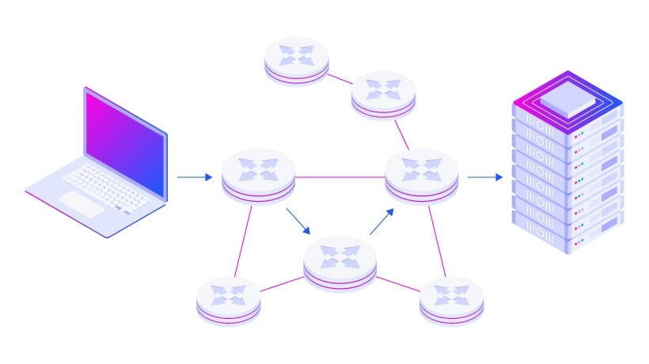

### 1. 라우팅, 라우터란?

!!! note "Network Routing - 라우팅이란?"

    라우팅은 에트워크에서 경로를 선택하는 프로세스입니다. 
    
    라우팅을 통해 네트워크 통신의 효율성을 높일 수 있습니다.

!!! note "Network Router - 라우터란?"

    라우터는 OSI 7계층에서 네트워크 계층에 포함되는 기기입니다. 
    
    논리적으로 분리된 망, 혹은 물리적으로 분리된 망 사이를 지나가야 하는 패킷들에게 경로를 뽑아 자기가 아는 최선의 경로를 찾아낸 뒤 (라우팅, 경로설정) 다른 망으로 패킷을 보내주는 역할 (포워딩, 스위칭) 을 하는 기계입니다. 

!!! note "라우터의 종류"

    라우터의 종류는 네트워크에서 사용되는 위치나 규모에 따라 다양합니다. ISP 의 랜이나 여러개의 ISP network 를 연결하는 `코어 라우터` 에서부터 흔히 포켓 와이파이로 알려진 `모바일 라우터`에 이르기 까지 다양한 종류가 있습니다. 하지만 기본적인 기능은 모두 같습니다.
    
    라우터의 기능을 클라우드에서 가상화하여 소프트웨어로 제공하는 가상 라우터도 있습니다.

### 2. 라우팅 동작, 라우팅 테이블이란?

!!! note "라우팅은 어떻게 동작하나요?"

    데이터 패킷이 도착하면 라우터는 먼저 라우팅 테이블에서 목적지의 주소를 찾습니다. 그 다음 라우터는 패킷을 네트워크의 다음 지점으로 전달합니다.

    예를 들어 사무실 네트워크에서 웹 사이트를 방문하면, 데이터 패킷이 먼저 사무실 네트워크 라우터로 이동합니다. 라우터가 헤더 패킷을 조회하고 패킷 대상을 결정합니다. 그 다음 내부 테이블을 조회하고, 네트워크 자체 내에서 패킷을 다음 라우터로 전달하거나 프린터와 같은 다른 디바이스로 전달합니다.

구체적인 라우팅 동작 과정은 아래에서 살펴보겠습니다

!!! note "라우팅 테이블이란?"

    라우터가 라우팅 테이블을 만드는 방식에 따라 라우팅은 두가지 유형으로 구분 됩니다. 네트워크 관리자가 네트워크 설계나 파라미터를 사전에 분석하여 정적으로 테이블을 구축하는 방식과 런타임에 동적으로 스스로 업데이트 되는 방식입니다. (정적 라우팅 (테이블)과 동적 라우팅 (테이블))

    일반적으로 동적 라우팅 방식이 변화하는 네트워크 조건에 대응하기 좋습니다.

라우팅 테이블을 만드는 구체적인 방식은 아래에서 살펴보겠습니다.

