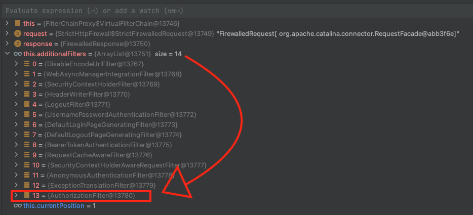

@ 참고 자료)

-  spring-security reference - [링크](https://docs.spring.io/spring-security/reference/6.0.0-M5/servlet/authorization/authorize-http-requests.html)

---

문서를 한번 읽었으니 이제 디버그모드로 인가 프로세스를 확인해 보면 좋을것 같습니다.

```java title="SecurityFilterChain Bean"

@Bean  
fun filterChain(http: HttpSecurity): SecurityFilterChain {  
    return http  
        .csrf().disable()  
        .httpBasic().disable()  
        .headers().frameOptions().sameOrigin()  
        .and()  
  
        .formLogin()  
        .defaultSuccessUrl("/chat/room")  
        .and()  
        .oauth2ResourceServer().jwt()  
        .and()  
        .and()  
        .authorizeHttpRequests()  
        .requestMatchers("/webjars/**", "/", "/error/**",".ico").permitAll()  
        .requestMatchers("/chat/**").hasRole("USER")  
        .anyRequest().denyAll()  
  
        .and()  
        .build()  
}

```


---

#### 1. 요청이 AuthorizationFilter 에 도착하여 AuthorizationManager 에 전달 되기 까지

1. FilterChainproxy$VirtualFilterChain 에서 시작한다.



2. 모든 앞 필터를 다 통과하고 `AuthorizationFilter` 에 도착한다.
3. 그 과정에서 `SecurityContextHolder` 에는 `AnonymousAuthenticationFilter` 에 의해 `AnonymousAuthenticationToken` 이 저장된다.


4. 권한 부여 대상이 아닌 경우를 판단 하기 위해 전처리를 살짝 해 준다.


5. 가지고 있는 authorizationManager 의 check 을 통해 AccessDecision 획득하고 이를 통해 ACCESS_ABSTAIN 혹은 ACCESS_DENIED 라면 직접 예외를 터트린다.


#### 2. AuthorizationManager 의 동작 - [참고 링크](https://docs.spring.io/spring-security/reference/6.0.0-M5/servlet/authorization/architecture.html#authz-delegate-authorization-manager)

위와 같은 `authorizeHttpRequests` 에 경로와 권한 제어 정보만 넘겨준 설정에서는 어떤 `AuthorizationManager` 가 기본적으로 등록될까요? 그 녀석은 바로 `RequestMatcherDelegatingAuthorizationManager` 입니다. 

`RequestMatcherDelegatingAuthorizationManager` 는 `RequestMatcherEntry` 목록을 가집니다. `그리RequestMatcherEntry` 는 요청에 대한 권한 여부를 판별할지 판단하는 `RequestMatcher` 와 권한을 판단하는 `AuthorizationManager` 의 Pair 입니다.

설정에 의해 추가 된 `RequestMatcherDelegatingAuthorizationManager` 의 `mappings` 필드와 그 녀석의 check 메서드의 동작방식은 아래 그림과 같습니다.


- `RequestMatcherDelegatingAuthorizationManager` 
	 - implements  `AuthorizationManager<HttpServletRequest>` 
	 - 즉 HttpServletRequest 자체를 securityObject 타입으로 가집니다.
	 - 기존의 `AccessDecisionManager` 와 비슷한 역할을 합니다.
	 - 공식 문서에서는 Delegate-based AuthorizationManager 구현 이라고 표현합니다.
	 - 디자인 패턴의 Composite 패턴이 적용되었습니다.

- AuthorityAuthorizationManager 나, AuthenticatedAuthorizationManager, permitall, denyall 
	- 설정에 의해 `RequestAuthorizationContext` 타입을 securityObject 타입으로 가집니다.
	- 기존의 AccessDecisionVoter 와 비슷한 역할을 합니다.

#### 3. 그 이후

그 이후는  기존의 Authorization 프로세스와 동일합니다. authorizationManager 의 결과에 따라 예외가 발생하였다면 바로 앞의 ExceptionTranslationFilter 에 의해 처리가 됩니다. 위의 기본 설정으로는 기본 authenticationEntrypoint 로 commence. 즉, 로그인 페이지로 리디렉션이 발생합니다.

예외가 발생하지 않았다면 요청은 Spring Security Filter 를 마지고 web mvc 의 Dispatcher Servlet 까지 전달 될 것입니다.

