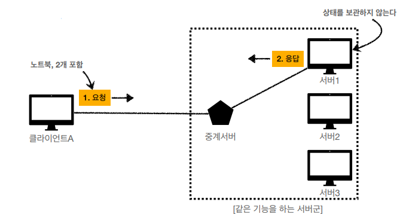

@참고 자료)

- 인프런 김영한 - [모든 개발자를 위한 HTTP 웹 네트워크](https://www.inflearn.com/course/http-웹-네트워크)

---

### 0. 들어가며

HTTP 의 중요한 특징 두가지는 STATELESS 와 CONNECTIONLESS 입니다. 두 특성은 커지는 전세계 네트워크에도 프로토콜 자체의 확장성과 가벼움을 유지하는데 그 의의를 가집니다. 하지만 현실적으로 두가지를 모두 만족하는 네트워크 통신을 하는 것은 불가능합니다.

{++STATELESS++} 가 가지는 문제점은 {++쿠키/세션/토큰++} 등을 통해  {==CONNECTIONLESS==} 가 가지는 문제점은 {==HTTP 1.1에 추가된 Persistent Connection(keep-alive 스펙)==}을 통해 어느정도 해결할 수 있습니다.

이 문서에서는 {++STATELESS++} 가 가지는 문제점과 이를 해결하기 위해 등장한 {++쿠키/세션/토큰++}에 대해서 알아보겠습니다.

### 1. HTTP 와 STATELESS

HTTP 는 무상태 프로토콜입니다. 즉 {++서버가 클라이언트의 상태를 보존하지 않습니다++}.

이의 장점으로는 서버의 확장성이 높다는 것이 있고 단점으로는 클라이언트가 추가 데이터를 전송해야 한다는 점이 있습니다.

=== "STATEFULL - 장애에 취약"

    

=== "STATELESS - 장애에 대응 가능, 수평 확장 유리."

    

하지만 모든것을 무상태로 설계 할 수는 없습니다. 로그인기능을 구현하기 위해 매번 아이디와 비밀번호를 요청에 포함하는 것 혹은 장바구니 기능을 위해 매번 장바구니의 상태를 서버에게 전송하는 것은 합리적이지 않습니다. 

### 2. 쿠키와 세션

#### 쿠키

-   HTTP 쿠키란 사용자가 웹 사이트를 방문할 경우 사용자의 웹 브라우저를 통해 사용자의 컴퓨터나 다른 기기에 설치된느 작은 텍스트 파일
-   쿠키는 key, value, 0개 이상의 속성을 가진다.
    -   속성은 쿠키의 만료 기간, 도메인, 플래그 등의 정보를 저장한다.
-   HTTP 응답의 `Set-Cookie` 헤더와 HTTP 요청의 `Cookie` 헤더에 포함된다.
-   브라우저에 저장되기 때문에 보안상 한계가 있다.
    -   민감하거나 중요한 정보를 담으면 안된다.

- 쿠키는 브라우저에만 존재하기 때문에 IOS, 나 Android 같은 앱에서는 사용할 수 없습니다. 

#### 세션

-   stateful
-   사용자의 방문을 논리적인 단위로 나눈 것
-   서버에 저장된다.
-   쿠키에 세션 아이디를 담아 응답하고 다시 쿠키에서 전달받아 사용자를 식별한다.
 
- 세션은 서버의 RDB에 저장하기 보다 Redis 와 같은 메모리 데이터베이스에 저장하는 것이 일반적입니다. 
- 세션은 확장에 불리합니다.

---

### 3. 토큰

-   stateless
-   서버가 다중화된 경우에 세션은 스티키 세션 혹은 세션 클러스터링(redis, memchached) 등 fail tolerant 를 갖추기 위한 노력이 필요하다.
-   이러한 부담없이 인증과 인가를 구현하기 위해 고안된 것이 Token, JWT 방식
-   **토큰 자체에 정보를 담는 방식**
-   `Verify Signature = HS256(Header+"."+Payload, secretKey)`
-   이미 발급된 토큰은 제어할 수 없습니다.
    -   유호시간을 최대한 짧게 가져며 refresh 토큰을 함께가져가는 것이 좋습니다.

 
- 토큰 방식은 DB의 사용을 최소화 하고 관리 포인트를 낮출 수 있다는 장점이 있습니다.
- 하지만 사용자의 인증 상태에 대한 세밀한 관리 (강제 로그아웃 등)를 할 수는 없습니다.
